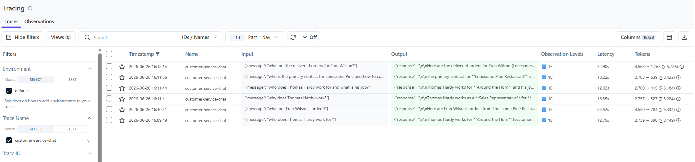
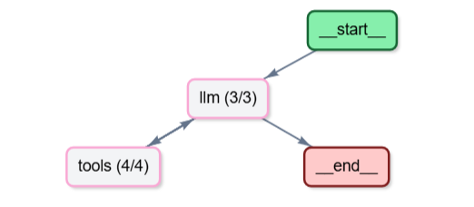
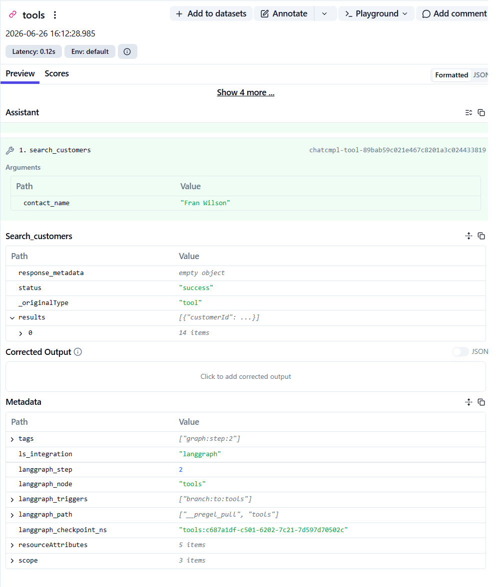
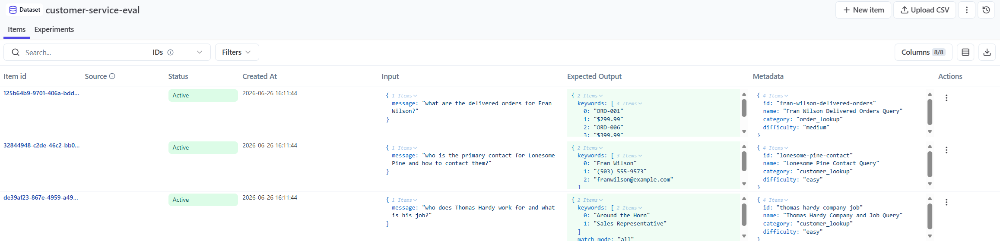
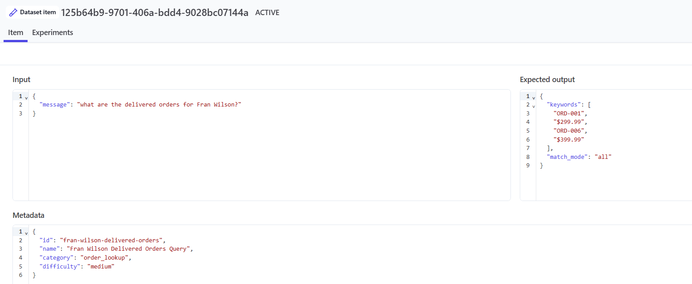
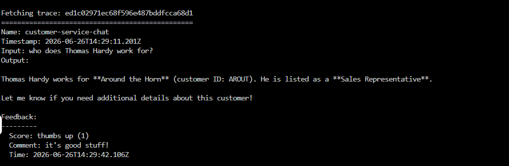
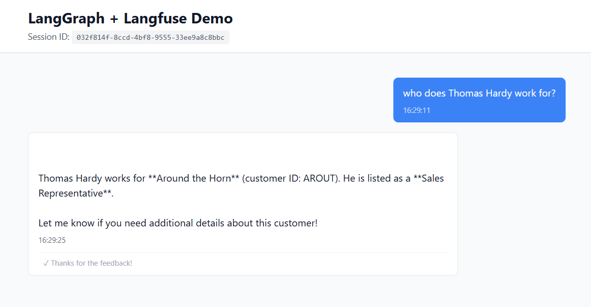

# Agentic AI with LangGraph, Llama Stack & Langfuse
### A Visual Companion to the Red Hat Agentic AI Workshop

This repo is a **step-by-step visual guide** to the Red Hat Agentic AI Workshop. It shows you what to expect at each stage — from running your first agent to viewing traces, running evaluations, and collecting feedback in Langfuse.

> **The source code lives here → [rh-aiservices-bu/agentic-workshop](https://github.com/rh-aiservices-bu/agentic-workshop)**
> Clone that repo and follow the instructions below alongside it.

---

## What You'll Build

A production-style AI agent that:
- Uses **LangGraph** to orchestrate multi-step reasoning
- Runs inference via **Llama Stack** (vLLM backend)
- Calls real tools via **MCP** (Model Context Protocol)
- Sends every trace, eval, and feedback signal to **Langfuse**

```
User → FastAPI → LangGraph Agent → MCP Tools → LLM
                                                 ↓
                                             Langfuse
                                   (Traces · Evals · Feedback)
```

---

## Step 1 — Clone & Run the Workshop Code

Follow the setup instructions in the [Red Hat workshop repo](https://github.com/rh-aiservices-bu/agentic-workshop), then start the agent:

```bash
cd backend
python 6-langgraph-langfuse-fastapi-chatbot.py
```

Then send your first message:

```bash
curl -X POST http://localhost:8002/chat \
  -H "Content-Type: application/json" \
  -d '{"message": "who does Thomas Hardy work for?"}'
```

Once it's running, open Langfuse. Here's what you should see:

---

## Step 2 — Check Your Traces

Every agent run produces a trace. You should see a list of them in the Langfuse dashboard:



Click into any trace to inspect the full reasoning chain — inputs, tool calls, LLM responses, and timing at every step:



---

## Step 3 — Inspect Tool Usage

The agent calls MCP tools to fetch customer and finance data. You can see exactly what was passed in and returned for each tool call:



---

## Step 4 — Run Evaluations

Trigger the evaluation endpoint to score agent responses against a test dataset:

```bash
curl -X POST http://localhost:8002/evaluate \
  -H "Content-Type: application/json" \
  -d '{"run_name": "test-run"}'
```

Your datasets and test cases will appear in Langfuse like this:





---

## Step 5 — Collect Feedback

User feedback can be attached directly to traces. This closes the loop between what users experience and what you observe in Langfuse:



---

## Step 6 — Use the Chat UI

The workshop also includes a simple chat interface for testing the agent interactively without using curl:



---

## Tech Stack

| Layer | Technology |
|---|---|
| Agent orchestration | [LangGraph](https://github.com/langchain-ai/langgraph) |
| LLM inference | [Llama Stack](https://github.com/meta-llama/llama-stack) + vLLM |
| Tool protocol | [MCP](https://modelcontextprotocol.io) |
| Observability | [Langfuse](https://langfuse.com) |
| API server | [FastAPI](https://fastapi.tiangolo.com) |
| Deployment | OpenShift / Kubernetes |

---

## Credits

All workshop code by the [Red Hat AI Services team](https://github.com/rh-aiservices-bu). This repo provides visual documentation and expected outputs to help you follow along.

If this helped you, ⭐ star both repos!
